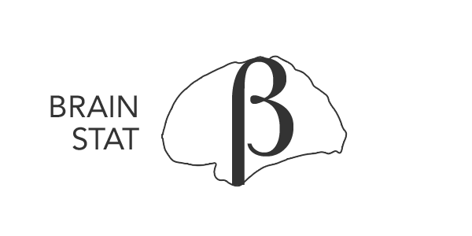

Welcome to BrainStat's documentation!
======================================

.. image:: https://img.shields.io/pypi/l/brainspace?label=License
   :target: https://opensource.org/licenses/BSD-3-Clause

Analysis and interpretation of neuroimaging datasets has become a multidisciplinary enterprise, relying not only on statistical methods but increasingly on the cross-referencing of other features for contextualization. Here we introduce BrainStat, a cross-platform toolbox that allows for (i) the univariate and multivariate statistical analysis of brain imaging datasets, (ii) ad hoc contextualization of results with respect to spatial maps of post-mortem gene expression and histology, as well as task-based fMRI meta-analysis and motifs of intrinsic functional brain organization. 

Our toolbox flexibly (iii) handles common surface, volume, and parcel level data formats, and (iv) provides a series of interactive visualization functions. The toolbox has been implemented in both python and matlab, the two most widely adopted programming languages in the neuroimaging and neuroinformatics communities, is openly available, and complemented by an expandible documentation. 

.. toctree::
   :maxdepth: 1
   :caption: Table of Contents:

   theory
   install
   python_doc/python_index
   matlab_doc/matlab_index
   references
   funding

Developers
----------
.. |seyma_s|   unicode:: U+015E .. CEDILLA S

- Reinder Vos de Wael - MICA Lab, Montreal Neurological Institute
- |seyma_s|\ eyma Bayrak - Max Planck Institute for Human Cognitive and Brain Sciences 
- Oualid Benkarim - MICA Lab, Montreal Neurological Institute
- Sara Lariviere - MICA Lab, Montreal Neurological Institute
- Raul Cruces - MICA Lab, Montreal Neurological Institute
- Peer Herholz - Montreal Neurological Institute 
- Seok-Jun Hong - Sungkyunkwan University
- Sofie Valk - Max Planck Institute for Human Cognitive and Brain Sciences
- Boris Bernhardt - Montreal Neurological Institute 

License
-------

The BrainStat source code is available under the BSD (3-Clause) license.

Support
-------

If you have problems installing the software or questions about usage and
documentation, or something else related to BrainStat, you can post to the
`Issues <https://github.com/MICA-MNI/BrainStat/issues>`_ section of our repository.
